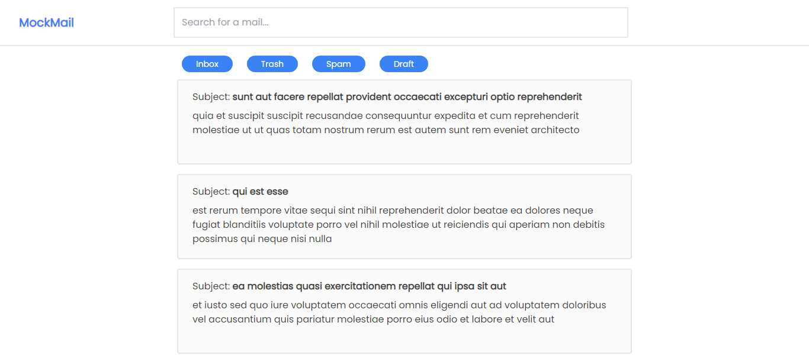
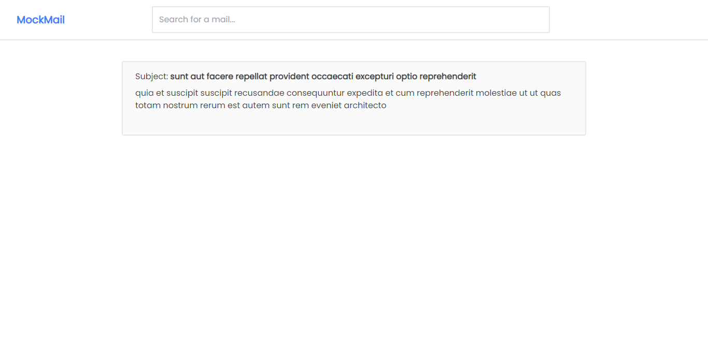
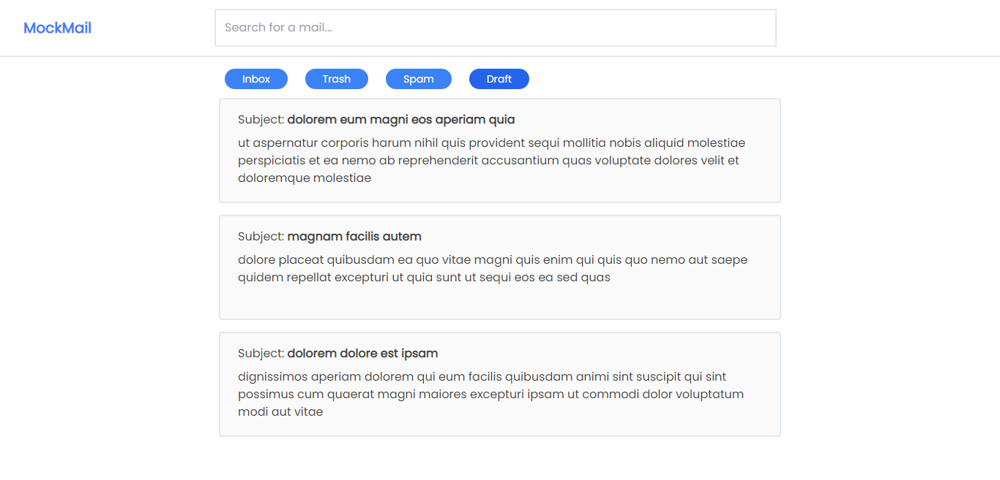
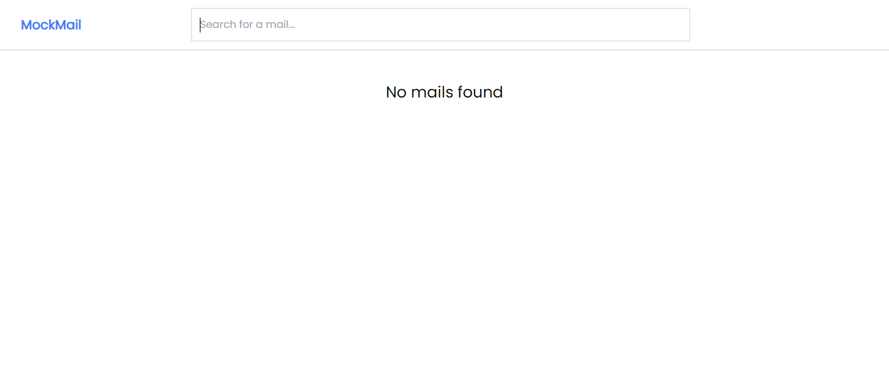
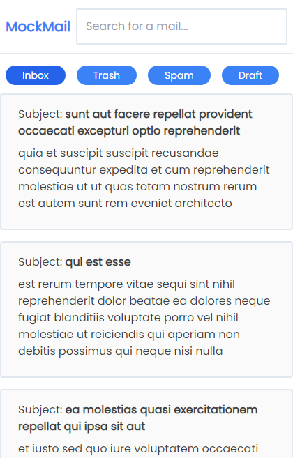
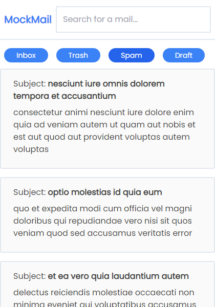
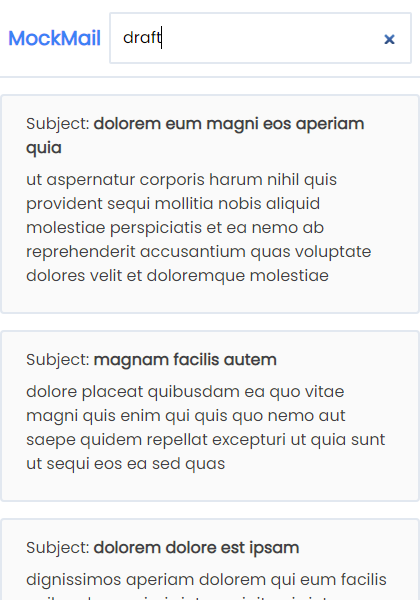
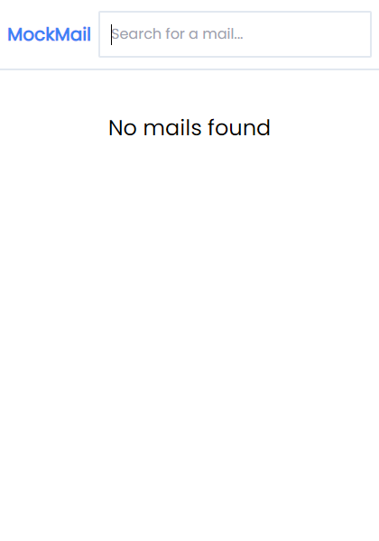

[](https://app.netlify.com/sites/debarshib-mockmail/deploys)

# MockMail

A simple web for mails

## Demo

[Deployed on Netlify using github actions](https://debarshib-mockmail.netlify.app/)

## Features:

- List of mails
- Search mails by text
- Mails based on different filters
- Uses _memoized selectors_ to cache and optimize heavy computations
- Uses Redux to maintain data state
- ErrorBoundary to catch UI errors and show fallback UI

## Built using:

- [ReactJS](https://reactjs.org/) - Frontend framework
- [ReduxToolkit](https://redux-toolkit.js.org/) - Centralized state management
- [TailwindCSS](https://tailwindcss.com/) - UI styling

## Screenshots

#### Desktop









#### Mobile

<div align="center">









</div>

<br/>

## Run Locally

- Clone the project
  ```
  git clone https://github.com/Debarshi95/MockMail.git
  ```
- Go to the project directory
- cd **mockmail**
- Install dependencies
  ```
  yarn
  ```
- Create a **.env.local** file

- Add the following configuration to your .env file

  ```
  REACT_APP_BASE_URL="Provided Api base url"
  ```

- Start the server
  ```
  yarn start
  ```
